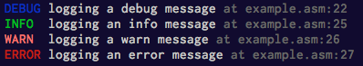

# log.mac

Minimal yet colorful logging macros.

```asm
%include "log.mac"

section .text
  log_text   ; very important to include this

_start:
  ; supplying length
  log_debug DEBUGMSG, DEBUGLEN

  ; as long as msg is null terminated we can omit length (slightly slower though)
  log_info  INFOMSG
  log_warn  WARNMSG
  log_error ERRORMSG
```



## Installation

```
curl -L https://raw.githubusercontent.com/thlorenz/log.mac/master/log.mac > log.mac
```

## Compatibility

Linux i386 (32-bit).

## License

MIT
