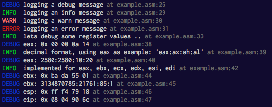

# log.mac

Minimal yet colorful logging macros.

```asm
%include "log.mac"

section .text
  log_text   ; very important to include this

_start:
  ; supplying length
  log_debug debug, debug.len

  ; as long as  is null terminated we can omit length (slightly slower though)
  log_info  info
  log_warn  warn
  log_error error

  log_info  registers
  xor eax, eax
  mov ah, 10
  mov al, 20

  log_eax
  log_info dec_format
  log_eax_dec

  log_info dec_impl
  mov ebx, 0xbada5501
  log_ebx
  log_ebx_dec
  log_esp
  log_eip   ; yes you can log the instruction pointer too :)
```



## Installation

```
curl -L https://raw.githubusercontent.com/thlorenz/log.mac/master/log.mac > log.mac
```

## Compatibility

Linux i386 (32-bit).

## License

MIT
